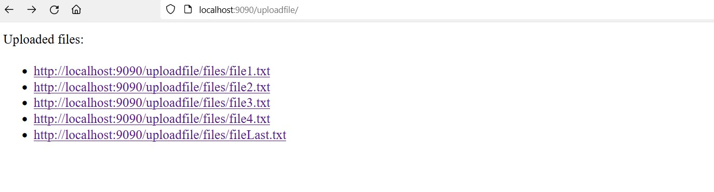

# File Storage System

## Description

Project built with SpringBoot and Maven, a file storage system with upload and download. Thymeleaf is used for visualization in browser. Mainly for learning purposes.

## Gallery

